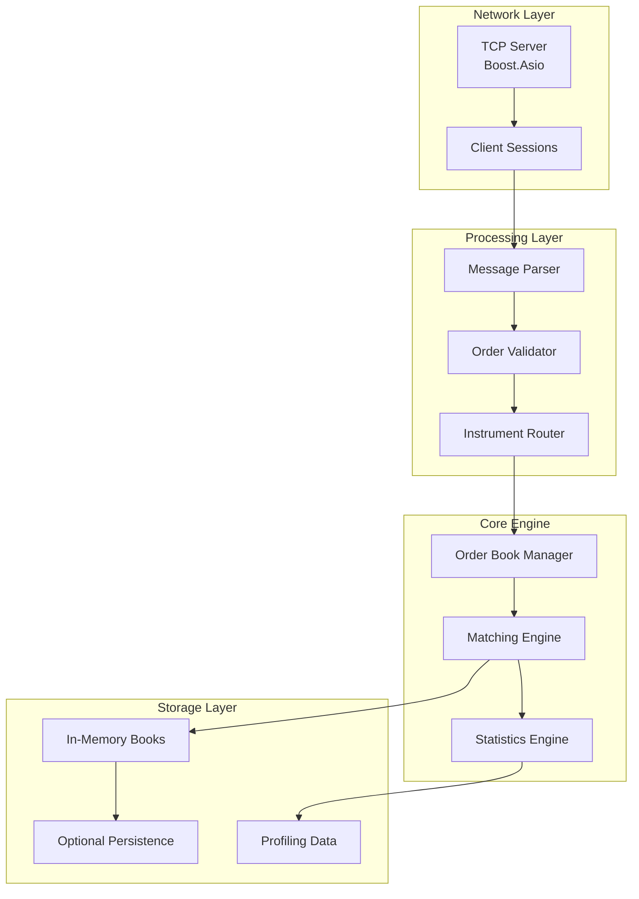

# Aurora LOB Design Document

## Overview

Aurora LOB is a high-performance limit order book simulator built with modern C++20, designed to emulate a financial exchange's matching engine. The system architecture prioritizes low-latency order processing, concurrent operations, and real-time market simulation capabilities with millisecond-level latency requirements.

The core design follows a multi-threaded architecture with separate I/O and processing threads, utilizing Boost.Asio for network operations and fine-grained locking strategies for thread safety. The system supports multiple instruments, historical data replay, comprehensive performance profiling, and optional state persistence. Key design principles include price-time priority matching, FIFO ordering within price levels, and graceful error handling with proper client notification.

## Architecture

### High-Level Architecture



### Threading Model

The system employs a hybrid threading approach:

- **I/O Thread Pool**: Dedicated threads for network operations using Boost.Asio's thread pool
- **Worker Thread Pool**: Separate threads for order processing and matching
- **Statistics Thread**: Optional dedicated thread for market statistics calculation
- **Persistence Thread**: Background thread for state snapshots when persistence is enabled

**Rationale**: This separation ensures network I/O doesn't block order processing, and statistics calculation doesn't impact critical path latency.

## Components and Interfaces

### Core Components

#### 1. Network Layer

**TCPServer Class**

```cpp
class TCPServer {
public:
    void start(uint16_t port);
    void stop();
    void set_message_handler(std::function<void(SessionPtr, MessagePtr)> handler);
private:
    boost::asio::io_context io_context_;
    boost::asio::ip::tcp::acceptor acceptor_;
    std::vector<std::thread> io_threads_;
};
```

**Session Class**

```cpp
class Session : public std::enable_shared_from_this<Session> {
public:
    void start();
    void send_response(const Response& response);
    void close();
private:
    boost::asio::ip::tcp::socket socket_;
    std::array<char, 1024> buffer_;
};
```

#### 2. Order Processing

**Order Structure**

```cpp
struct Order {
    uint64_t order_id;
    std::string instrument_id;
    OrderType type;  // LIMIT, MARKET, CANCEL
    Side side;       // BUY, SELL
    double price;
    uint64_t quantity;
    uint64_t remaining_quantity;
    std::chrono::high_resolution_clock::time_point timestamp;
};
```

**OrderBook Class**

```cpp
class OrderBook {
public:
    void add_order(const Order& order);
    void cancel_order(uint64_t order_id);
    std::vector<Trade> match_order(const Order& order);
    BookSnapshot get_snapshot() const;

private:
    // Price-time priority queues
    std::map<double, std::queue<Order>, std::greater<double>> bids_;  // Descending
    std::map<double, std::queue<Order>, std::less<double>> asks_;     // Ascending
    std::unordered_map<uint64_t, OrderLocation> order_index_;
    mutable std::shared_mutex book_mutex_;
};
```

#### 3. Matching Engine

**MatchingEngine Class**

```cpp
class MatchingEngine {
public:
    ProcessingResult process_order(const Order& order);
    void set_statistics_callback(std::function<void(const Trade&)> callback);

private:
    std::unordered_map<std::string, std::unique_ptr<OrderBook>> books_;
    std::shared_mutex books_mutex_;
    StatisticsEngine stats_engine_;
};
```

**Design Decision**: Using separate OrderBook instances per instrument ensures complete isolation and allows for instrument-specific optimizations.

#### 4. Configuration Management

**Configuration Class**

```cpp
class Configuration {
public:
    static Configuration& instance();
    void load_from_file(const std::string& filename);
    void load_from_args(int argc, char* argv[]);

    uint16_t get_port() const { return port_; }
    size_t get_io_threads() const { return io_threads_; }
    size_t get_worker_threads() const { return worker_threads_; }
    bool is_persistence_enabled() const { return enable_persistence_; }

private:
    uint16_t port_ = 8080;
    size_t io_threads_ = 4;
    size_t worker_threads_ = std::thread::hardware_concurrency();
    bool enable_persistence_ = false;
    std::string config_file_;
};
```

### Interface Design

#### Message Protocol

**Order Message Format (JSON)**

```json
{
  "type": "ORDER",
  "order_id": 12345,
  "instrument_id": "AAPL",
  "order_type": "LIMIT",
  "side": "BUY",
  "price": 150.25,
  "quantity": 100,
  "timestamp": "2024-01-01T10:30:00.123Z"
}
```

**Response Message Format**

```json
{
  "type": "ACK|FILL|REJECT",
  "order_id": 12345,
  "status": "ACCEPTED|FILLED|PARTIAL_FILL|REJECTED",
  "filled_quantity": 50,
  "remaining_quantity": 50,
  "fill_price": 150.25,
  "message": "Order accepted"
}
```

## Data Models

### Core Data Structures

#### Order Lifecycle States

```cpp
enum class OrderStatus {
    PENDING,
    ACCEPTED,
    PARTIAL_FILL,
    FILLED,
    CANCELLED,
    REJECTED
};
```

#### Trade Record

```cpp
struct Trade {
    uint64_t trade_id;
    uint64_t buy_order_id;
    uint64_t sell_order_id;
    std::string instrument_id;
    double price;
    uint64_t quantity;
    std::chrono::high_resolution_clock::time_point timestamp;
};
```

#### Market Statistics

```cpp
struct MarketStats {
    std::string instrument_id;
    double best_bid;
    double best_ask;
    double spread;
    uint64_t bid_depth;
    uint64_t ask_depth;
    uint64_t total_volume;
    uint64_t trade_count;
    std::chrono::high_resolution_clock::time_point last_update;
};
```

### Memory Management Strategy

**Design Decision**: Use smart pointers for automatic memory management and RAII principles:

- `std::shared_ptr` for objects shared across threads (Sessions, Orders in flight)
- `std::unique_ptr` for owned resources (OrderBooks, Configuration)
- Stack allocation for temporary objects and small data structures

## Error Handling

### Error Categories

#### Network Errors

- Connection timeouts
- Malformed messages
- Client disconnections

**Strategy**: Graceful session cleanup with proper resource deallocation. Log errors but continue serving other clients.

#### Order Processing Errors

- Invalid order parameters
- Duplicate order IDs
- Cancel requests for non-existent orders

**Strategy**: Return appropriate error responses to clients. Maintain system stability by validating all inputs.

#### System Errors

- Memory allocation failures
- Thread creation failures
- Configuration errors

**Strategy**: Fail-fast approach for critical system errors. Graceful degradation for non-critical components.

### Exception Safety

```cpp
class OrderBook {
    std::vector<Trade> match_order(const Order& order) noexcept {
        try {
            // Matching logic with strong exception safety
            std::lock_guard<std::shared_mutex> lock(book_mutex_);
            return perform_matching(order);
        } catch (const std::exception& e) {
            // Log error and return empty result
            logger_.error("Matching failed: {}", e.what());
            return {};
        }
    }
};
```

**Design Decision**: Use RAII and strong exception safety guarantees to ensure the order book remains in a consistent state even when exceptions occur.

## Testing Strategy

### Unit Testing Framework

**Framework**: Catch2 for comprehensive unit testing

**Test Categories**:

1. **Order Book Tests**

   - Price-time priority verification
   - Partial fill handling
   - Cancel operation correctness
   - Concurrent access safety

2. **Matching Engine Tests**

   - Order routing to correct instruments
   - Trade generation accuracy
   - Statistics calculation correctness

3. **Network Layer Tests**
   - Message parsing and validation
   - Session management
   - Error response generation

### Integration Testing

**Multi-threaded Integration Tests**

```cpp
TEST_CASE("Concurrent order processing") {
    MatchingEngine engine;
    std::vector<std::thread> clients;

    // Spawn multiple client threads submitting orders
    for (int i = 0; i < 10; ++i) {
        clients.emplace_back([&engine, i]() {
            submit_test_orders(engine, i * 100);
        });
    }

    // Verify final state consistency
    for (auto& t : clients) t.join();
    verify_book_consistency(engine);
}
```

### Performance Testing

**Benchmarking Strategy**:

- Google Benchmark for micro-benchmarks
- Latency measurement at each processing stage
- Throughput testing under various load conditions
- Memory usage profiling with gperftools

```cpp
static void BM_OrderMatching(benchmark::State& state) {
    OrderBook book;
    setup_test_book(book);

    for (auto _ : state) {
        Order order = generate_test_order();
        auto trades = book.match_order(order);
        benchmark::DoNotOptimize(trades);
    }
}
BENCHMARK(BM_OrderMatching);
```

### Stress Testing

**Load Testing Scenarios**:

- High-frequency order submission
- Burst traffic patterns
- Large order book depths
- Multiple instrument simultaneous trading

**Design Decision**: Separate performance testing from functional testing to ensure both correctness and performance requirements are met independently.

## Performance Considerations

### Latency Optimization

**Critical Path Analysis**:

1. Network receive → Message parsing → Order validation → Book lookup → Matching → Response generation

**Optimization Strategies**:

- Lock-free data structures where possible
- Memory pool allocation for frequent objects
- Branch prediction optimization in hot paths
- NUMA-aware thread affinity

### Memory Layout Optimization

```cpp
// Cache-friendly order storage
struct alignas(64) CacheAlignedOrder {
    Order order;
    // Pad to cache line boundary
    char padding[64 - sizeof(Order) % 64];
};
```

### Concurrency Design

**Fine-grained Locking Strategy**:

- Per-instrument order book locks
- Reader-writer locks for book access
- Lock-free queues for inter-thread communication

**Design Decision**: Balance between lock contention and complexity. Start with fine-grained locking and migrate to lock-free structures only where profiling indicates bottlenecks.

## Profiling and Monitoring

### Integrated Profiling

**CPU Profiling**:

```cpp
#ifdef ENABLE_PROFILING
#include <gperftools/profiler.h>

class ProfiledMatchingEngine : public MatchingEngine {
public:
    ProfiledMatchingEngine() {
        ProfilerStart("aurora_lob.prof");
    }
    ~ProfiledMatchingEngine() {
        ProfilerStop();
    }
};
#endif
```

**Memory Profiling**:

- Heap profiling with gperftools
- Memory leak detection
- Allocation pattern analysis

### Real-time Metrics

**Metrics Collection**:

- Order processing latency (p50, p95, p99)
- Throughput (orders/second)
- Memory usage patterns
- Thread utilization

**Design Decision**: Make profiling optional and configurable to avoid performance impact in production-like scenarios while providing detailed insights during development and testing.

#

# Historical Data Simulation

### Replay Engine Design

**HistoricalReplayEngine Class**

```cpp
class HistoricalReplayEngine {
public:
    void load_data_file(const std::string& filename);
    void start_replay(double time_scale = 1.0);
    void inject_order(const Order& order);
    void set_completion_callback(std::function<void(const ReplayStats&)> callback);

private:
    std::vector<TimestampedOrder> historical_orders_;
    std::chrono::high_resolution_clock::time_point replay_start_;
    double time_scale_;
    std::thread replay_thread_;
    MatchingEngine* engine_;
};
```

**Design Decision**: The replay engine operates independently from the live order processing system, allowing for controlled simulation environments while maintaining the ability to inject new orders for strategy testing.

### Data Format Support

**Historical Order Format**:

```json
{
  "timestamp": "2024-01-01T09:30:00.123Z",
  "order_id": 12345,
  "instrument_id": "AAPL",
  "order_type": "LIMIT",
  "side": "BUY",
  "price": 150.25,
  "quantity": 100
}
```

**Rationale**: JSON format provides flexibility for different data sources while maintaining human readability for debugging and analysis.

## Graceful Shutdown and Recovery

### Shutdown Manager

**ShutdownManager Class**

```cpp
class ShutdownManager {
public:
    void register_signal_handlers();
    void initiate_shutdown();
    bool is_shutdown_requested() const { return shutdown_requested_.load(); }
    void wait_for_completion();

private:
    std::atomic<bool> shutdown_requested_{false};
    std::vector<std::function<void()>> shutdown_callbacks_;
    std::condition_variable shutdown_complete_;
    std::mutex shutdown_mutex_;
};
```

### Shutdown Sequence

1. **Signal Reception**: Catch SIGINT/SIGTERM signals
2. **Stop Accepting**: Close TCP acceptor to prevent new connections
3. **Drain Pipeline**: Process all in-flight orders
4. **Send Final Reports**: Ensure all execution reports are sent
5. **Close Sessions**: Gracefully disconnect all clients
6. **Resource Cleanup**: Free all allocated resources

**Design Decision**: Implement a coordinated shutdown sequence that ensures data integrity and proper client notification, preventing abrupt disconnections that could lead to inconsistent state.

## State Persistence (Optional)

### Persistence Manager

**PersistenceManager Class**

```cpp
class PersistenceManager {
public:
    void enable_persistence(const std::string& snapshot_dir);
    void create_snapshot();
    bool restore_from_snapshot();
    void set_snapshot_interval(std::chrono::seconds interval);

private:
    std::string snapshot_directory_;
    std::chrono::seconds snapshot_interval_;
    std::thread persistence_thread_;
    std::atomic<bool> persistence_enabled_{false};
};
```

### Snapshot Format

**Binary Snapshot Structure**:

- Header: Version, timestamp, checksum
- Order Books: Serialized bid/ask queues per instrument
- Trade History: Recent trades for recovery validation
- Statistics: Current market statistics

**Design Decision**: Use binary format for snapshots to minimize I/O overhead while including checksums for data integrity verification during recovery.

## Detailed Latency Metrics

### Latency Measurement Framework

**LatencyProfiler Class**

```cpp
class LatencyProfiler {
public:
    void start_measurement(const std::string& stage);
    void end_measurement(const std::string& stage);
    void report_metrics() const;

private:
    struct StageMetrics {
        std::vector<std::chrono::nanoseconds> samples;
        std::chrono::nanoseconds total_time{0};
        size_t count{0};
    };

    std::unordered_map<std::string, StageMetrics> stage_metrics_;
    thread_local std::unordered_map<std::string, std::chrono::high_resolution_clock::time_point> start_times_;
};
```

### Measurement Points

**Critical Path Stages**:

1. **Network Receive**: Socket read to message buffer
2. **Message Parse**: Buffer to structured order object
3. **Order Validation**: Input validation and sanitization
4. **Book Lookup**: Instrument routing and book access
5. **Order Matching**: Core matching algorithm execution
6. **Response Generation**: Trade/ack message creation
7. **Network Send**: Response transmission to client

**Percentile Reporting**:

```cpp
struct LatencyReport {
    std::chrono::nanoseconds p50, p95, p99, p999;
    std::chrono::nanoseconds min, max, average;
    size_t sample_count;
};
```

**Design Decision**: Implement fine-grained latency measurement with minimal overhead using thread-local storage and high-resolution timers, providing detailed insights into performance bottlenecks.

## Multi-Instrument Architecture

### Instrument Manager

**InstrumentManager Class**

```cpp
class InstrumentManager {
public:
    void register_instrument(const std::string& instrument_id);
    void remove_instrument(const std::string& instrument_id);
    OrderBook* get_order_book(const std::string& instrument_id);
    std::vector<std::string> get_active_instruments() const;
    MarketStats get_instrument_stats(const std::string& instrument_id) const;

private:
    std::unordered_map<std::string, std::unique_ptr<OrderBook>> instruments_;
    mutable std::shared_mutex instruments_mutex_;
};
```

### Configuration-Driven Instrument Management

**Instrument Configuration**:

```json
{
  "multi_instrument": {
    "enabled": true,
    "default_single_book": false,
    "instruments": ["AAPL", "GOOGL", "MSFT", "TSLA"],
    "dynamic_creation": true,
    "max_instruments": 1000
  }
}
```

**Dynamic Instrument Handling**:

- **Static Mode**: Pre-configured instruments loaded at startup from configuration
- **Dynamic Mode**: Instruments created on-demand when first order arrives
- **Hybrid Mode**: Pre-configured instruments plus dynamic creation up to max limit

**Design Decision**: Support both static and dynamic instrument management to accommodate different use cases - from controlled simulations with known instruments to exploratory testing with arbitrary symbols.

### Cross-Instrument Considerations

**Isolation Strategy**: Each instrument maintains completely separate order books and statistics to prevent cross-contamination and enable independent scaling.

**Resource Management**: Dynamic instrument creation with lazy initialization to minimize memory footprint for unused instruments. Instruments can be removed when inactive for extended periods.

**Removal Strategy**: Instruments can only be removed when no active orders exist and all pending operations are complete, ensuring data consistency.

## Configuration Management Details

### Configuration Schema

**JSON Configuration Format**:

```json
{
  "network": {
    "port": 8080,
    "io_threads": 4,
    "max_connections": 1000
  },
  "processing": {
    "worker_threads": 8,
    "queue_size": 10000
  },
  "profiling": {
    "enabled": true,
    "cpu_profiling": true,
    "memory_profiling": false,
    "latency_tracking": true
  },
  "persistence": {
    "enabled": false,
    "snapshot_interval_seconds": 300,
    "snapshot_directory": "./snapshots"
  },
  "instruments": ["AAPL", "GOOGL", "MSFT"],
  "replay": {
    "data_file": "",
    "time_scale": 1.0
  },
  "multi_instrument": {
    "enabled": true,
    "default_single_book": false
  }
}
```

**Command Line Override Examples**:

```bash
./aurora_lob --port 9090 --worker-threads 16 --enable-profiling
```

**Configuration Validation**:

```cpp
class ConfigurationValidator {
public:
    static bool validate_config(const Configuration& config);
    static std::vector<std::string> get_validation_errors();

private:
    static bool validate_network_config(const NetworkConfig& net_config);
    static bool validate_processing_config(const ProcessingConfig& proc_config);
    static bool validate_file_paths(const Configuration& config);
};
```

**Design Decision**: Provide comprehensive configuration options with sensible defaults, allowing fine-tuning of all performance-critical parameters without requiring recompilation. Include validation to ensure configuration integrity and provide clear error messages for invalid settings.

### Configuration Loading Strategy

**Priority Order**:

1. Command-line arguments (highest priority)
2. Configuration file values
3. Built-in defaults (lowest priority)

**Error Handling**: The system will terminate gracefully with detailed error messages if critical configuration parameters are invalid, ensuring no silent failures that could lead to unexpected behavior.
